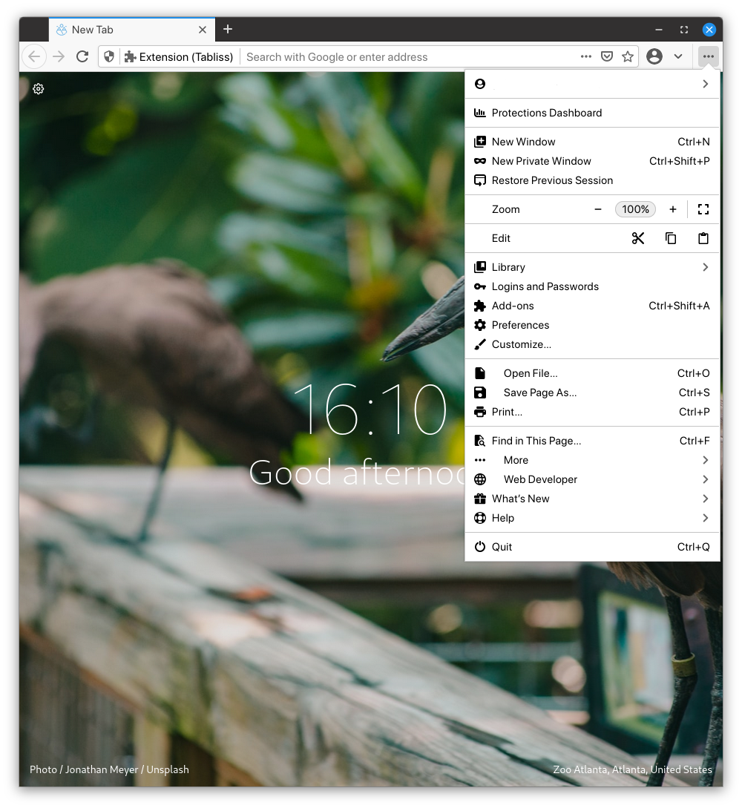
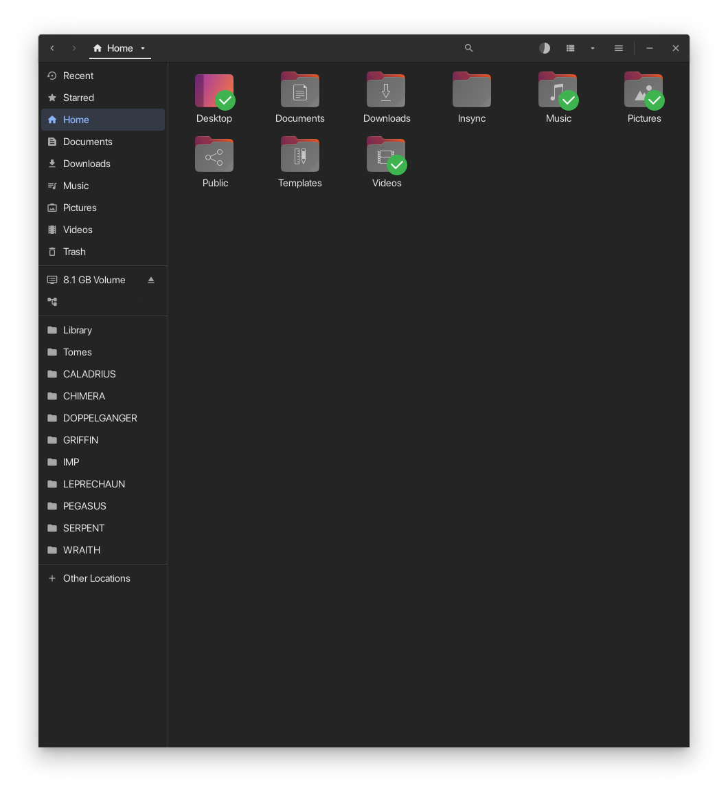
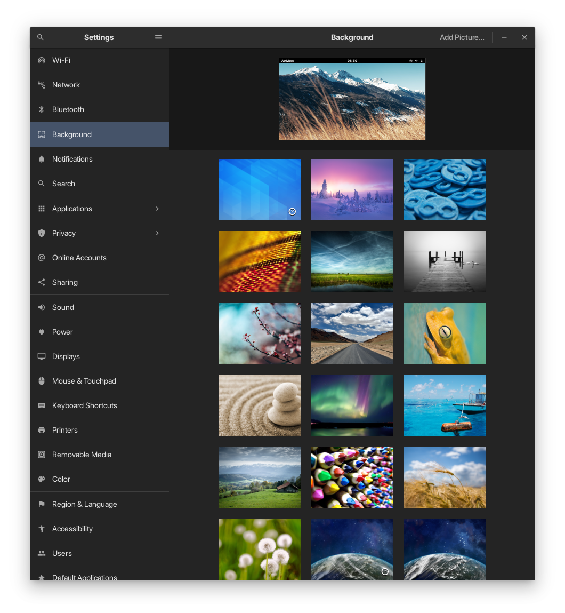
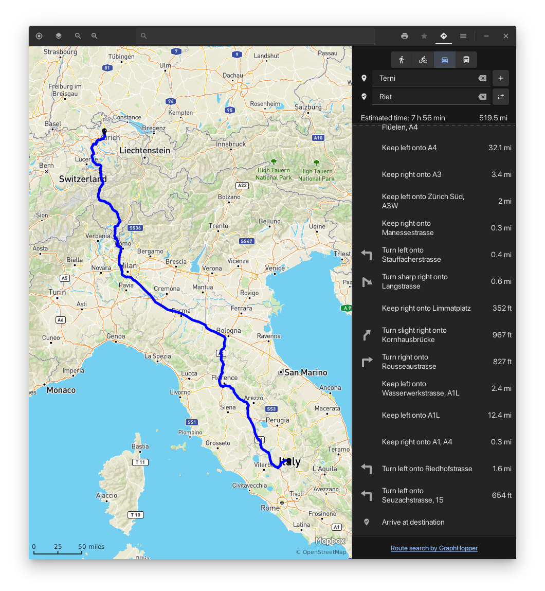
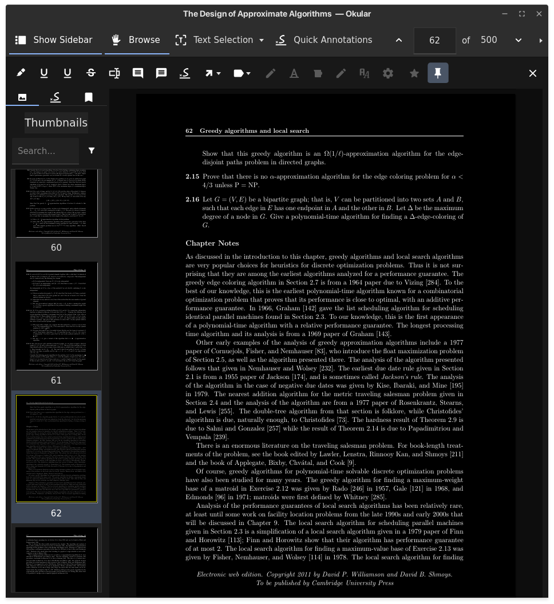
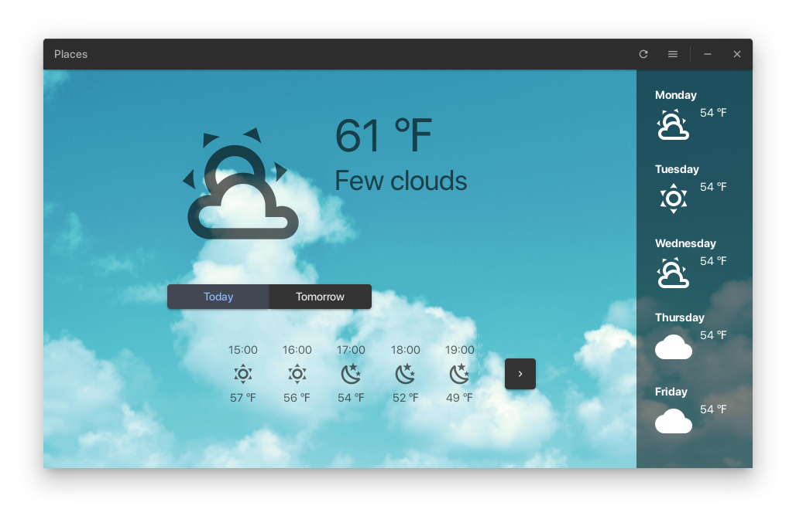
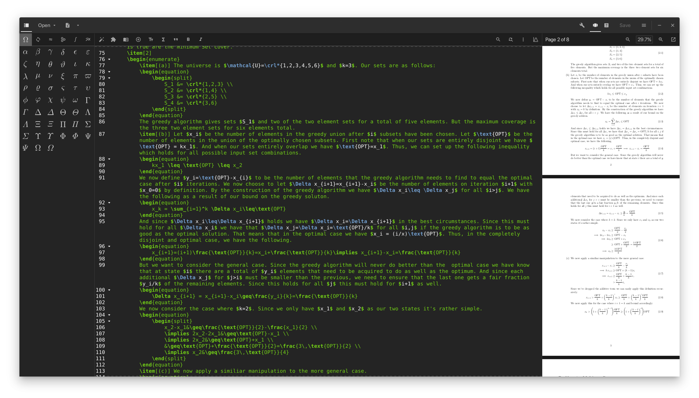
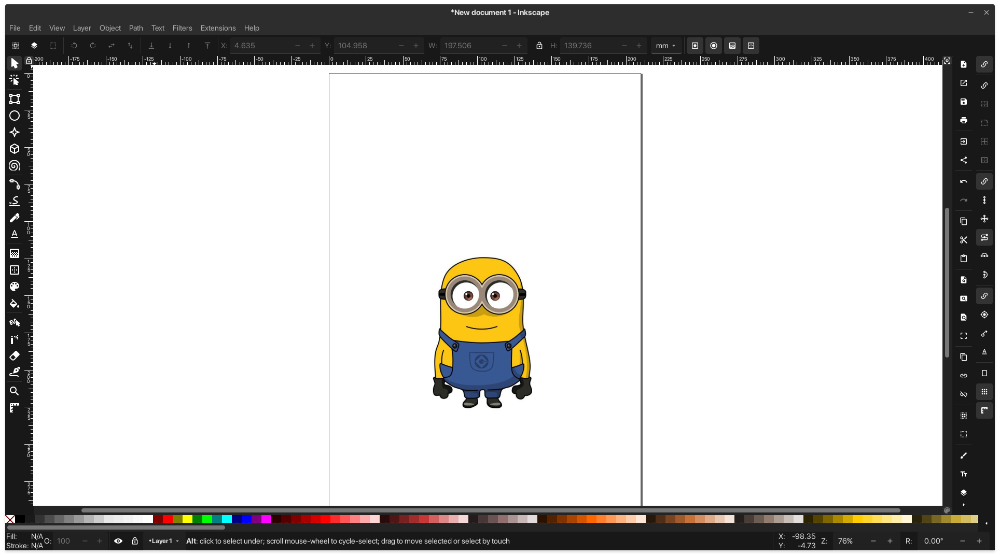
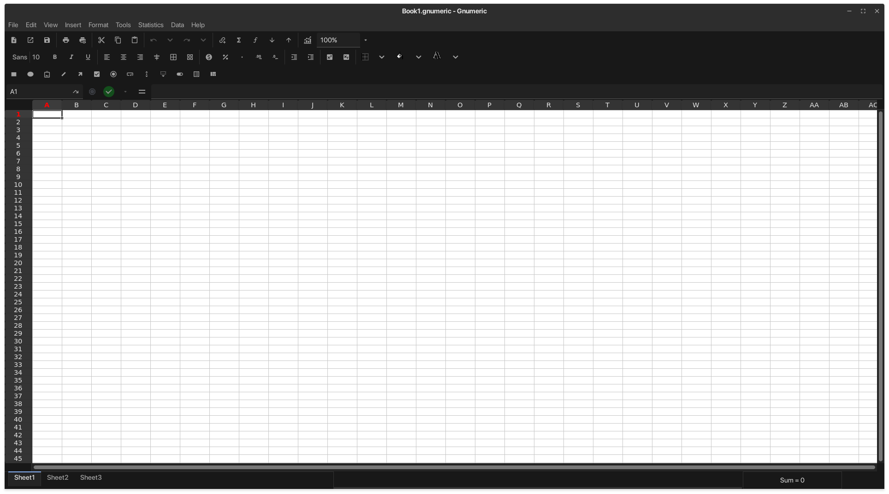

# Symbolia

Symbolia is a set of clean, consistent, and non-distracting symbolic icons for GNOME and other desktop environments. It is modeled after Google's Material Design and includes original icons as well as [ones provided by Google itself](https://material.io/resources/icons/?style=baseline) and [ones made by the community](https://materialdesignicons.com/). Symbolia supports all the standard icons defined in the [freedesktop naming specifications](https://specifications.freedesktop.org/icon-naming-spec/icon-naming-spec-latest.html) as well as numerous other apps.

All icons included are in the symbolic style. But, there are both symbolic and non-symbolic versions of the icons included. That being said, it is best used on top of or in conjunction with another non-symbolic icon theme for maximum aesthetic.

## Installation

If you _just_ want to use Symbolia icons, you can run the `scripts/basic-install` and `scripts/basic-uninstall` scripts to install and uninstall respectively. Or just copy/paste the following line into your terminal.

```shell
cd ~/Downloads && git clone https://github.com/GabePoel/Symbolia.git && cd Symbolia/scripts && sh ./basic-install
```

Then just delete the Symbolia folder.

### Firefox Installation

Firefox requires custom CSS to overwrite the default icons. Luckily, that's provided. There's a basic installation script for Firefox as well. But, manual installation is recommended.

```shell
cd ~/Downloads && git clone https://github.com/GabePoel/Symbolia.git && cd Symbolia/scripts && sh ./firefox-install
```

## Symbolia in Action

Symbolia can be used with any theme, but [Materia](https://github.com/nana-4/materia-theme) is recommended. The non-symbolic icons in the following screenshots are from [Yaru](https://github.com/ubuntu/yaru).



















## Supported Programs

Officially, Symbolia is only guaranteed to be maintained for GNOME and the standard freedesktop icons. However, symbolic UI icons have also been added for the following programs. Note that application icons for many more programs are also included.

- All common/standard GNOME programs
- Epiphany
- Tilix
- Evince
- Fractal
- Inkscape
- Setzer
- GNOME Maps
- Geary
- Kalzium
- GNOME Weather
- Xournal++
- Icon Library
- Transmission
- Pitivi
- Gnumeric
- Okular
- Alacarte
- Nemo
- HomeBank
- GNUCash
- GNU Denemo
- Subtitle Editor
- PDF Slicer
- PDF Arranger
- Komikku
- Meteo
- Firefox
- Teleport
- Fragments
- System76 Driver
- Firmware Manager
- _and others_

Many other programs also have symbolic application icons but no custom UI. There's also an extensive library of supported mimetypes. Eventually, it'd be nice to be able to support Breeze and KDE programs as well.

## Supported Extensions

Extensions generally have their icons hard coded. However, support for many extensions is still included along with a script to automatically theme them accordingly.

- Caffeine
- Draw On Screen
- Extensions Sync
- Freon
- GSConnect
- Night Theme Switcher
- Time++
- Pop! Shell

Note that most extensions don't have any custom icons at all. So, no tweaking is needed.